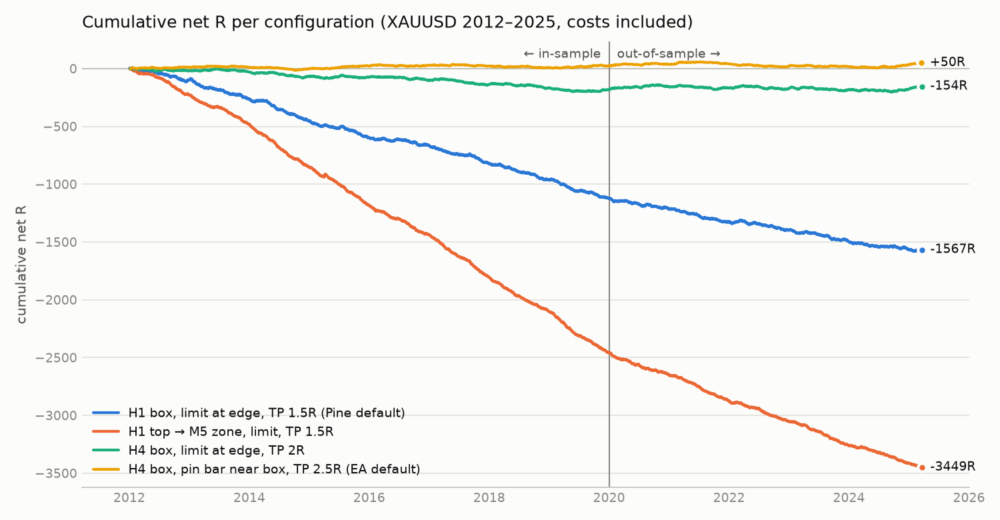
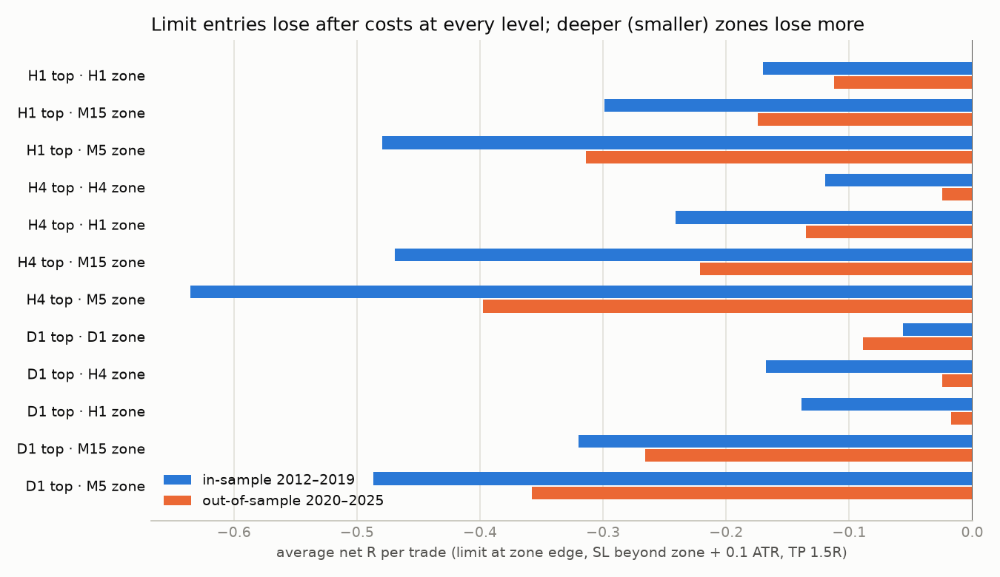
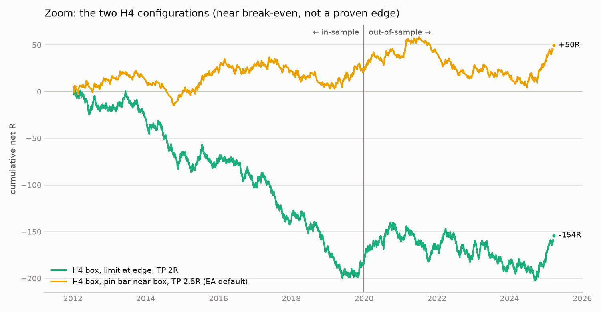

<div dir="rtl">

# گزارش بک‌تست و بهینه‌سازی استراتژی «خلأ حجم عمودی» (Vertical Volume Gap Cascade) روی طلا (XAUUSD)

> داده: XAUUSD با تیک‌ولوم، ژانویه ۲۰۱۲ تا مارس ۲۰۲۵ — همه‌ی اعداد **بعد از کسر اسپرد و کمیسیون** و بر حسب **R** هستند
> (R = مقداری که در هر معامله ریسک می‌شود، یعنی فاصله‌ی ورود تا حد ضرر).
> بازه‌ی **درون‌نمونه (IS)**: ۲۰۱۲ تا ۲۰۱۹ — بازه‌ی **خارج از نمونه (OOS)**: ۲۰۲۰ تا مارس ۲۰۲۵ (هیچ پارامتری با آن انتخاب نشده).

---

## خلاصه‌ی نتیجه (اول این را بخوانید)

1. **نسخه‌ی H1 (تنظیم پیش‌فرض کد Pine شما) در هیچ ترکیبی از حد ضرر و ریوارد سودده نیست.**
   ۱۸۰۰ ترکیب مختلف (سطح ورود H1/M15/M5، عمق ورود، محل حد ضرر، بافر، ریوارد ۰٫۵ تا ۴، عمر ستاپ) تست شد؛ بهترینِ آن‌ها در IS برابر −۰٫۰۹R و در OOS برابر −۰٫۰۴R در هر معامله بود. حتی **بدون هیچ هزینه‌ای** میانگین تقریباً صفر است (−۰٫۰۲R)؛ یعنی جهت قیمت بعد از برگشت به باکس، عملاً تصادفی است و هزینه‌ها آن را منفی می‌کنند.
2. **شرط «خلأ حجم» به‌تنهایی مزیتی ایجاد نمی‌کند.** در یک آزمایش کنترلی، همین منطق را با باکسِ **هر کندلی** (بدون شرط حجم بالا-پایین-بالا) اجرا کردم؛ نتیجه همان‌قدر یا کمی بهتر بود.
3. **تریگرهای عمیق‌تر (M15 و M5) از خود باکس اصلی بدترند** و هرچه باکس کوچک‌تر، زیان بیشتر (حد ضرر کوچک‌تر ⇒ سهم هزینه و نویز بیشتر). M1 به‌دلیل نبود دیتای یک‌دقیقه‌ای تست نشد، ولی طبق همین روند به احتمال زیاد از همه ضعیف‌تر است.
4. **بهینه‌سازی واقعی (Walk-Forward)** — یعنی انتخاب بهترین تنظیمات فقط با داده‌ی ۴ سال گذشته و معامله‌ی کور در سال بعد — در ۲۰۱۶ تا ۲۰۲۵ این نتیجه را داد: H1: **−۰٫۰۹R** در هر معامله (۲۱۰۲ معامله)، H4: **≈ ۰** (−۰٫۰۰۲R)، D1: **−۰٫۰۷R**. یعنی تنظیماتی که روی گذشته «بهینه» به نظر می‌رسند، در آینده تکرار نمی‌شوند.
5. **تنها نسخه‌ی نزدیک به سربه‌سر:** باکس **H4** + ورود با **پین‌بارِ نزدیک باکس (بدون لمس باکس)** + حد ضرر **پشت لبه‌ی دور باکس + ۰٫۱ ATR(H1)** + حد سود **۲٫۵R**:
   ‎+۰٫۰۳R (IS) و ‎+۰٫۰۵R (OOS) در هر معامله، حدود ۹۵ معامله در سال، ولی **از نظر آماری معنادار نیست** (t ≈ ۰٫۶–۰٫۷) و افت سرمایه‌ی آن ۳۷ تا ۵۴R بوده است. تنظیمات پیش‌فرض اکسپرت روی همین نسخه گذاشته شده، **برای تست، نه برای ترید واقعی**.
6. **توصیه‌ی صادقانه:** با این قوانین به‌تنهایی وارد حساب واقعی نشوید. اکسپرت را روی دیتای خود LiteFinance تست کنید (راهنما در بخش ۵). اگر دیتای M1 لایت‌فایننس را بدهید، کل تحقیق را با تریگر M1 و ولوم واقعی بروکر خودتان تکرار می‌کنم (بخش ۷).

برای درک مقیاس: نسخه‌ی H1 سالانه حدود ۸۰۰ معامله می‌دهد و میانگین −۰٫۱۷R دارد؛ با ریسک ۰٫۵٪ در هر معامله یعنی حدود **۷۰٪ زیان در سال**. نسخه‌ی H4 پین‌بار با همان ریسک، حدود **+۲٪ در سال** با افت سرمایه‌ی **۱۸ تا ۲۷٪** — که برای ترید ارزش ندارد.



---

## ۱. داده و روش

| مورد | توضیح |
|---|---|
| داده | XAUUSD کندل‌های ۵ دقیقه‌ای با تیک‌ولوم (خروجی متاتریدر یک بروکر، دیتاست عمومی «XAU/USD 2004–2025»)، با ساعت سرور GMT+2 زمستان / GMT+3 تابستان — همان ساعت سرور لایت‌فایننس |
| بازه | ۲۰۱۱/۰۶ (گرم‌کردن اندیکاتورها) → ۲۰۲۵/۰۳/۲۰؛ تحلیل از ۲۰۱۲/۰۱/۰۱. سال ۲۰۲۵ بعد از مارس در دیتاست ناقص بود و کنار گذاشته شد |
| تایم‌فریم‌ها | H1، M15 و H4، D1 از خود کندل‌های M5 ساخته شدند (حجم = جمع تیک‌ولوم) |
| هزینه | اسپرد = بیشترِ ‎$0.20 و ۱ واحد در ده‌هزار قیمت (حدود ‎$0.20 تا ‎$0.30) + کمیسیون ‎$0.07 به ازای هر اونس ⇐ حدود ‎$0.27 تا ‎$0.37 رفت‌وبرگشت |
| اجرا | Buy Limit وقتی پر می‌شود که Ask به قیمت برسد، حد ضرر/سود Sell روی Ask؛ اگر در یک کندل هم حد ضرر و هم حد سود لمس شود، **حد ضرر اول** فرض شد (بدبینانه). با فرض معمول مسیر OHLC هم تکرار شد و تفاوت کمتر از ۰٫۰۱R بود |
| اعتبارسنجی | IS/OOS جدا + Walk-Forward غلتان (۴ سال آموزش، ۱ سال تست) + آزمایش کنترلی بدون شرط حجم + تست حساسیت پارامترها |
| شبیه‌ساز | دو شبیه‌ساز مستقل نوشته شد (سریع مبتنی بر MFE و شبیه‌ساز صریح TP/SL/Breakeven)؛ نتایجشان تا سه رقم اعشار یکی بود |

منطق Pine شما با همان جزئیات پیاده شد: کندل وسطی با حجم کمتر از دو همسایه ⇐ باکس؛ جهت از کلوز کندل سوم؛ اگر کلوز داخل باکس بود تا ۴ کلوز M15 صبر؛ حذف کندل‌های ۲۳:۳۰ و ۰۰:۳۰ تهران؛ آبشار «عمیق‌ترین کف محلی حجم» در تایم‌های پایین‌تر؛ فعال ماندن هر باکس تا لمس؛ جایگزینی ستاپ قبلی با ستاپ جدید.

---

## ۲. ایرادها و نکاتی که در کد Pine پیدا شد

1. **پین‌بار سمتِ اشتباه باکس را چک می‌کند.** در `f_nearZonePinBar` برای BUY شرط `low < zBot and close < zBot` است؛ یعنی کندلی که **از کل باکس عبور کرده و زیر کف باکس بسته شده**، نه کندلی که «نزدیک لبه‌ی نزدیک باکس» واکنش داده (توضیح هدر کد). در اکسپرت و تحقیق، نسخه‌ی موردنظر شما پیاده شد: پین‌بار در فاصله‌ی ۳۰٪ ارتفاع باکس از **لبه‌ی نزدیک**، بدون لمس باکس، و کلوز بیرون باکس.
2. **درجه‌بندی A تا D همیشه «A» است.** در لحظه‌ی اجرای آبشار، قیمت تازه بیرون باکس بسته شده (تعریف جهت همین است) و همه‌ی باکس‌های کوچک‌تر داخل باکس بزرگ‌اند؛ پس هیچ باکسی قیمت را در بر ندارد. در ۱۴٬۴۵۴ سیگنال، ۱۰۰٪ «A» بود. امتیاز هم‌پوشانی هم چون باکس‌ها تو‌در‌تو هستند، فقط تعداد مراحل پیداشده را می‌شمارد و اطلاعات جدیدی نمی‌دهد.
3. **انتظار M15 عملاً ۳ کندل است نه ۴.** کندل M15ای که هم‌زمان با کندل تأیید H1 بسته می‌شود، به‌عنوان اولین مورد از ۴ شمرده می‌شود. اکسپرت ۴ کندل M15 **بعد از** کندل تأیید را صبر می‌کند (همان‌طور که در هدر نوشته‌اید).
4. **سیگنال‌های تاریخچه در تریدینگ‌ویو احتمالاً یک کندل دیرتر از حالت زنده هستند.** `request.security` با `lookahead_off` روی کندل‌های تاریخی، مقدار تایم بالاتر را فقط در کندلِ بسته‌شدن آن می‌دهد؛ پس آرایه‌های Rung روی تاریخچه یک کندل عقب‌ترند. آنچه روی نمودار گذشته می‌بینید با آنچه زنده اتفاق می‌افتد کمی فرق دارد. اکسپرت منطق درستِ زنده را اجرا می‌کند.
5. **حذف ساعات ۲۳:۳۰ و ۰۰:۳۰ تهران تقریباً بی‌اثر است:** −۰٫۱۷۰R با حذف، −۰٫۱۷۷R بدون حذف، −۰٫۱۵۸R با حذف ساعت‌های ۲۲ تا ۰۱ سرور.
6. **سیگنال‌هایی که با انتظار M15 جهت گرفته‌اند بدترند:** ناخالص (بدون هزینه) −۰٫۰۹R در برابر −۰٫۰۵R (IS) و −۰٫۰۹R در برابر −۰٫۰۲R (OOS) برای سیگنال‌های مستقیم.

---

## ۳. نتایج

### ۳-۱. ورود لیمیت روی هر سطح (باکس اصلی و تریگرهای داخلی)

ورود Limit روی لبه‌ی نزدیک باکس، حد ضرر پشت لبه‌ی دور همان باکس + ۰٫۱ ATR(H1)، حد سود ۱٫۵R، ستاپ تا آمدن ستاپ بعدی فعال (مثل Pine):

| تایم اصلی | باکس ورود | درصد لمس | معاملات IS | ناخالص IS | خالص IS | ناخالص OOS | خالص OOS |
|---|---|---|---|---|---|---|---|
| H1 | H1 | ۷۷٪ | 6592 | −0.029 | **−0.170** | −0.021 | **−0.112** |
| H1 | M15 | ۶۷٪ | 5580 | −0.023 | **−0.299** | −0.012 | **−0.174** |
| H1 | M5 | ۶۳٪ | 5128 | −0.057 | **−0.480** | −0.059 | **−0.314** |
| H4 | H4 | ۸۰٪ | 1839 | −0.043 | −0.120 | +0.037 | −0.025 |
| H4 | H1 | ۶۸٪ | 1259 | −0.057 | −0.241 | −0.021 | −0.135 |
| H4 | M15 | ۶۵٪ | 1439 | −0.121 | −0.469 | +0.012 | −0.221 |
| H4 | M5 | ۶۴٪ | 1328 | −0.149 | −0.636 | −0.076 | −0.397 |
| D1 | D1 | ۷۲٪ | 343 | −0.049 | −0.056 | −0.085 | −0.089 |
| D1 | H4 | ۵۹٪ | 286 | −0.085 | −0.168 | +0.014 | −0.024 |
| D1 | H1 | ۵۶٪ | 219 | +0.062 | −0.139 | +0.052 | −0.017 |
| D1 | M15 | ۵۴٪ | 260 | −0.057 | −0.320 | −0.066 | −0.266 |
| D1 | M5 | ۵۵٪ | 245 | −0.120 | −0.487 | −0.083 | −0.358 |

«درصد لمس» جواب سؤال شماست که «آیا قیمت بعد از شکست به تریگرهای پایین‌تر برمی‌گردد؟»: حدود دو سوم مواقع قیمت تا باکس M5 هم برمی‌گردد؛ ولی **هرچه عمیق‌تر برگردد، احتمال این‌که از باکس عبور کند (شکست فیک) بیشتر است** و نتیجه بدتر می‌شود.



### ۳-۲. آزمایش کنترلی: آیا شرط «خلأ حجم» مهم است؟

میانه‌ی نتیجه‌ی ناخالص (بدون هزینه) روی همه‌ی ترکیب‌های پارامتر:

| تایم اصلی | باکس | خلأ حجم IS | هر کندل IS | خلأ حجم OOS | هر کندل OOS |
|---|---|---|---|---|---|
| H1 | H1 | −0.021 | −0.007 | −0.015 | −0.000 |
| H1 | M15 | −0.030 | −0.016 | −0.018 | −0.008 |
| H1 | M5 | −0.034 | −0.023 | −0.030 | −0.013 |
| H4 | H4 | −0.030 | −0.010 | +0.055 | +0.011 |
| D1 | H1 | +0.072 | −0.005 | −0.057 | −0.009 |

در H1 و H4 باکسِ هر کندل دلخواه همان‌قدر (یا کمی بهتر) کار می‌کند؛ پس «کم بودن حجم کندل وسط» اطلاعات جهت‌دار اضافه‌ای به قیمت نمی‌دهد. مزیت D1 در IS هم در OOS تکرار نشد.

### ۳-۳. جواب سؤال اصلی: چه حد ضرری و چه ریواردی؟

**چرا تغییر ریوارد مشکل را حل نمی‌کند:** وقتی ورود مزیت جهت‌دار ندارد، با بزرگ کردن حد سود فقط درصد برد پایین می‌آید. درصد برد ناخالص باکس H1 دقیقاً روی مقدار سربه‌سرِ یک حرکت تصادفی است:

| ریوارد (RR) | ۰٫۷۵ | ۱ | ۱٫۵ | ۲ | ۳ |
|---|---|---|---|---|---|
| درصد برد ناخالص (باکس H1) | ۵۵٫۹٪ | ۴۹٫۳٪ | ۳۹٫۲٪ | ۳۳٫۶٪ | ۲۷٫۵٪ |
| درصد برد لازم برای سربه‌سر | ۵۷٫۱٪ | ۵۰٫۰٪ | ۴۰٫۰٪ | ۳۳٫۳٪ | ۲۵٫۰٪ |

پس امید ریاضی ≈ صفر منهای هزینه است و هزینه به ازای هر معامله ≈ `هزینه ÷ فاصله‌ی حد ضرر`. نتیجه‌های عملی:

- **حد ضرر:** بهترین (کم‌ضررترین) محل، **پشت لبه‌ی دورِ بزرگ‌ترین باکس + ۰٫۱ تا ۰٫۲۵ ATR(H1)** است. حد ضرر داخل باکس‌های کوچک (M15/M5) یا پشت شدو‌ی پین‌بار **همیشه بدتر** بود (مثلاً پین‌بار H1 با ریوارد ۱٫۵: حد ضرر پشت شدو −۰٫۳۸R، حد ضرر پشت باکس −۰٫۰۵R).
- **ریوارد:** برای H4 پین‌بار، ناحیه‌ی **۲ تا ۳R** بهترین و پایدار بود (یک «فلات»، نه یک قله‌ی تیز)؛ ریوارد ۱ و کمتر منفی بود. برای H1 هیچ ریواردی مثبت نشد.
- **ریسک‌فری (Breakeven):** کمکی نکرد. در H4 پین‌بار: بدون BE ‏+۰٫۰۳۲/+۰٫۰۵۰، با BE در ۰٫۵R ‏−۰٫۰۰۷/+۰٫۰۱۴، در ۱R ‏+۰٫۰۲۳/−۰٫۰۱۴ (IS/OOS). توصیه: خاموش.
- **مدت نگهداری:** برای H4 حدود ۴ روز (۹۶ ساعت). تست حساسیت (۱ تا ۱۰ روز) نشان داد بین ۲ تا ۱۰ روز تفاوت معناداری نیست و ۱ روز کمی بدتر است (`research/results/hold_time_test.csv`).

### ۳-۴. ورود واکنشی: پین‌بار نزدیک باکس و کندل رد (Rejection)

(حد ضرر پشت باکس + ۰٫۱ ATR، پین‌بار و رد روی کندل‌های ۵ دقیقه‌ای؛ اعداد خالص)

| تایم اصلی | نوع ورود | RR | معاملات IS | IS | معاملات OOS | OOS |
|---|---|---|---|---|---|---|
| H1 | پین‌بار نزدیک باکس H1 | 1.5 | 1469 | −0.046 | 803 | −0.049 |
| H1 | کندل رد باکس H1 | 2 | 5719 | −0.083 | 3430 | −0.100 |
| H4 | پین‌بار نزدیک باکس H4 | 2 | 765 | +0.003 | 498 | +0.038 |
| H4 | **پین‌بار نزدیک باکس H4** | **2.5** | **765** | **+0.032** | **498** | **+0.050** |
| H4 | پین‌بار نزدیک باکس H4 | 3 | 765 | +0.031 | 498 | +0.043 |
| H4 | کندل رد باکس H4 | 3 | 1681 | −0.040 | 1102 | +0.051 |
| D1 | پین‌بار نزدیک باکس D1 | 2 | 263 | −0.047 | 194 | +0.147 |

این همان سناریویی است که گفتید «شاید قیمت به باکس نرسد و از نزدیکِ آن با یک دوجی/پین‌بار برگردد». روی H1 منفی است؛ روی H4 تنها حالتی است که در هر دو دوره ≥ صفر ماند (با بافرهای ۰ تا ۰٫۵ ATR و عمر ستاپ‌های مختلف هم مثبت ماند)، ولی مقدارش کوچک و از نظر آماری غیرقطعی است.



### ۳-۵. فیلترها (روی باکس H1، بدون هزینه، IS / OOS)

| فیلتر | با فیلتر | بدون فیلتر (بقیه) | قضاوت |
|---|---|---|---|
| فقط سیگنال‌های مستقیم (بدون انتظار M15) | −0.049 / −0.016 | −0.093 / −0.092 | کمی بهتر ولی هنوز منفی |
| هم‌جهت با روند D1 (قیمت نسبت به EMA50) | −0.040 / −0.018 | −0.088 / −0.071 | کمی بهتر ولی هنوز منفی |
| برگشت به باکس ۳ تا ۸ ساعت بعد از سیگنال | +0.050 / +0.216 | برگشت در ساعت اول: −0.081 / −0.065 | جالب ولی نمونه کم (۳۶۹ / ۱۹۲) |
| عمق خلأ حجم (حجم وسط ÷ همسایه) | هیچ الگوی پایداری | | بی‌اثر |
| سشن معاملاتی | هیچ الگوی پایداری | | بی‌اثر |

هیچ فیلتری نتیجه‌ی خالص H1 را در هر دو دوره مثبت نکرد. این فیلترها در اکسپرت قابل فعال‌سازی‌اند (`InpDirectOnly`، `InpTrendFilter`، `InpEntryDelayHours`، `InpGapRatio`) تا روی دیتای لایت‌فایننس بسنجید.

### ۳-۶. بهینه‌سازی Walk-Forward (مهم‌ترین تست «واقعی بودن»)

هر سال، از بین حدود ۵۰۰ تا ۹۰۰ ترکیب (سطح ورود، عمق ورود، مرجع حد ضرر، بافر، عمر ستاپ، تأخیر ورود، فیلتر مستقیم/روند، ریوارد)، بهترین ترکیبِ ۴ سال قبل انتخاب و در سال بعد اجرا شد:

| تایم اصلی | میانگین R در آموزش | معاملات تست ۲۰۱۶–۲۰۲۵ | میانگین R در تست | جمع R |
|---|---|---|---|---|
| H1 | −0.003 | 2102 | **−0.091** | −190 |
| H4 | +0.209 | 419 | **−0.002** | −1 |
| D1 | +0.753 | 83 | **−0.074** | −6 |

فاصله‌ی بزرگ «آموزش» و «تست» در H4 و D1 یعنی عددهای خوبِ گذشته حاصل برازش بیش از حد (Overfitting) بوده‌اند. جزئیات سال‌به‌سال: `research/results/walk_forward.csv`.

---

## ۴. اکسپرت متاتریدر ۵ (`mql5/Experts/VolumeGapCascadeEA.mq5`)

همه‌ی منطق Pine + گزینه‌های تحقیق، با قابلیت بهینه‌سازی در Strategy Tester:

- **آبشار کامل** برای تایم اصلی D1 / H4 / H1 / M15 تا M5 و در آخر **M1** (`InpUseM1Stage`)، با همان قانون «عمیق‌ترین کف محلی حجم» و حالت خاکستری «در این تایم خلأ نیست ⇐ تایم پایین‌تر».
- **جهت** از کلوز کندل تأیید؛ اگر داخل باکس بود، انتظار تا `InpWaitBars` کلوز تایم پایین‌تر (برای H1 همان ۴ کندل M15).
- **حذف ساعات ۲۳:۳۰ و ۰۰:۳۰ تهران** (فقط برای H1، مثل Pine)، با تبدیل ساعت سرور به UTC (لایت‌فایننس: GMT+2 زمستان، GMT+3 تابستان).
- **ورود لیمیت** روی هر سطح دلخواه (`InpTradeZ0..Z4`، `InpTradeZM1`) و عمق دلخواه داخل باکس (`InpEntryDepth`).
- **ورود واکنشی**: پین‌بار نزدیک باکس بدون لمس (نسخه‌ی اصلاح‌شده‌ی قابلیت ۱)، و کندل رد.
- **حد ضرر**: پشت باکس خود/باکس بزرگ/شدو‌ی کندل واکنش + بافر ATR، حداقل/حداکثر فاصله؛ **حد سود** = RR؛ ریسک‌فری اختیاری؛ بستن بعد از N ساعت.
- **مدیریت سرمایه**: درصد ریسک از اکوییتی (با `OrderCalcProfit`) یا لات ثابت؛ فیلتر اسپرد؛ سقف پوزیشن.
- **رسم** باکس‌ها با همان رنگ‌های Pine (قرمز، نارنجی، صورتی، فیروزه‌ای، خاکستری) و فلش ورود.
- **خروجی آماری**: در پایان تست، در تب Journal جدول «R-multiple summary» به تفکیک نوع ورود (H4zone، H1zone، … PIN، REJ) چاپ می‌شود و لیست معاملات در `Common\Files\VGC_trades_XAUUSD.csv` ذخیره می‌شود.
- **معیار بهینه‌سازی سفارشی** (`OnTester`): آماره‌ی t میانگین R خالص (میانگین ÷ انحراف معیار × √تعداد) — به نتایج خوش‌شانسِ با معاملات کم امتیاز نمی‌دهد.

### تنظیمات آماده (`mql5/Presets/`)

| فایل | کاربرد |
|---|---|
| `VGC_H4_PinBar_default.set` | پیش‌فرض اکسپرت: H4 + پین‌بار نزدیک باکس، SL پشت باکس + ۰٫۱ ATR، TP ‏۲٫۵R |
| `VGC_H1_Pine_faithful_4zones.set` | دقیقاً مثل اندیکاتور: H1، لیمیت روی هر ۴ باکس (H1، M15، M5، M1)، TP ‏۱٫۵R — برای مقایسه با تریدینگ‌ویو |
| `VGC_H4_optimize_ranges.set` | بازه‌های پیشنهادی بهینه‌سازی (RR، بافر SL، پارامترهای پین‌بار، مدت نگهداری، تایم اصلی) |

---

## ۵. راهنمای تست در متاتریدر ۵ لایت‌فایننس

1. در MT5: `File → Open Data Folder` ⇐ فایل `VolumeGapCascadeEA.mq5` را در `MQL5\Experts\` و `ExportBarsCSV.mq5` را در `MQL5\Scripts\` کپی کنید و فایل‌های `.set` را در `MQL5\Presets\`.
2. در MetaEditor هر دو فایل را باز کنید و **Compile (F7)** بزنید. اینجا MetaEditor در دسترس نبود، پس کد دو بار بررسی شد: (الف) بررسی نحوی/نوعی با کامپایلر C++ و تعریف‌های API متاتریدر، (ب) **اجرای خود کد اکسپرت** در یک شبیه‌ساز MQL5 روی داده‌ی ۲۰۱۹–۲۰۲۱: همه‌ی ستاپ‌ها (H1: ۳۰۳۵، H4: ۸۸۲، D1: ۱۷۰) و همه‌ی ۲۸۶ ورود پین‌بار H4 دقیقاً با موتور تحقیق پایتون یکی بودند (`tools/mql5_check/`). اگر MetaEditor خطایی نشان داد، متن خطا را بفرستید.
3. `Tools → Options → Charts → Max bars in chart` را روی **Unlimited** بگذارید.
4. Strategy Tester (Ctrl+R):
   - Expert: `VolumeGapCascadeEA`، Symbol: **XAUUSD** لایت‌فایننس (اگر نامش فرق دارد، مثلاً با پسوند، همان را انتخاب کنید)، Timeframe: M5 (فقط برای نمایش؛ اکسپرت همه‌ی تایم‌ها را خودش می‌خواند).
   - Modelling: **Every tick based on real ticks** (دقیق‌ترین). برای بهینه‌سازی سریع‌تر می‌توانید «1 minute OHLC» بگذارید و بهترین‌ها را با Real ticks دوباره تست کنید.
   - Date: مثلاً ۲۰۲۰/۰۱/۰۱ تا امروز، Deposit ‏۱۰٬۰۰۰ دلار.
   - در تب Inputs روی Load بزنید و یکی از `.set`ها را بارگذاری کنید.
   - حساب از نوع **Hedging** باشد (در Netting، ورودهای چندگانه با هم ادغام می‌شوند).
5. بعد از تست، در تب **Journal** جدول «VGC ===== R-multiple summary» را ببینید. اعداد باید هم‌جهت با این گزارش باشند (به‌خاطر تفاوت دیتا و اسپرد، دقیقاً یکی نمی‌شوند).
6. **بهینه‌سازی درست:** Optimization = «Fast genetic»، معیار = **Custom max**، و **Forward = 1/3** (یک‌سوم آخر بازه خارج از نمونه می‌ماند). فقط تنظیماتی را قبول کنید که در بخش Forward هم مثبت باشند و همسایه‌هایشان (مثلاً RR کمی بیشتر/کمتر) هم خوب باشند. قله‌های تیز و تک = Overfitting.
7. ساعت سرور: اگر لایت‌فایننس ساعتش را عوض کرده باشد، `InpGMTWinter` و `InpGMTSummer` را تنظیم کنید (فعلاً GMT+2 / GMT+3).

### ورودی‌های مهم

| ورودی | معنی | پیش‌فرض |
|---|---|---|
| `InpTopTF` | تایم اصلی خلأ حجم (D1/H4/H1/M15) | H4 |
| `InpWaitBars` | تعداد کلوزهای تایم پایین‌تر برای تعیین جهت (۰ = حذف) | 4 |
| `InpDirectOnly` | فقط سیگنال‌هایی که جهتشان از خود کندل تأیید آمده | false |
| `InpGapRatio` | شدت خلأ: حجم وسط < ضریب × حجم همسایه‌ها (۱ = قانون Pine) | 1.0 |
| `InpTradeZ0..Z4` / `InpTradeZM1` | لیمیت روی باکس سطح ۰ (بزرگ) تا ۴ و باکس M1 | false |
| `InpTradePin` / `InpTradeReject` | ورود با پین‌بار نزدیک باکس / کندل رد | true / false |
| `InpReactTF` | تایم کندل‌های واکنش | M5 |
| `InpSLRef`, `InpSLBufATR` | مرجع حد ضرر و بافر (× ATR ساعتی) | باکس خود، 0.1 |
| `InpRR` | ریوارد | 2.5 |
| `InpBreakEvenR` | ریسک‌فری بعد از X برابر R (۰ = خاموش) | 0 |
| `InpMaxHoldHours` | بستن بعد از N ساعت | 96 |
| `InpReplaceOnNew` | ستاپ جدید، سفارش‌های ستاپ قبلی را لغو کند (مثل Pine) | true |
| `InpTrendFilter` | فقط هم‌جهت با روند روزانه | false |
| `InpRiskPct` | درصد ریسک هر معامله | 0.5 |

---

## ۶. محدودیت‌های این تحقیق

- دیتا از بروکر دیگری است (نه لایت‌فایننس و نه فید تریدینگ‌ویو شما). تیک‌ولوم هر بروکر فرق دارد؛ ولی چون آزمایش کنترلی نشان داد شرط حجم عملاً اثری ندارد، بعید است نتیجه‌ی کلی با دیتای دیگر عوض شود.
- **دیتای M1 در دسترس نبود** ⇐ باکس M1 و پین‌بار M1 تست نشدند (پین‌بار روی M5 تست شد). اکسپرت هر دو را دارد.
- هزینه‌ها تقریبی‌اند؛ حساب ECN ممکن است ارزان‌تر باشد، ولی چون نتیجه‌ی **ناخالص** H1 هم حدود صفر است، هزینه‌ی کمتر آن را سودده نمی‌کند.
- داده تا مارس ۲۰۲۵ است.

---

## ۷. قدم بعدی — چه چیزی لازم دارم

برای تست کامل با **تریگر M1** و **ولوم و اسپرد واقعی لایت‌فایننس**، یکی از این دو کافی است:

1. **دیتای خود لایت‌فایننس:** اسکریپت `ExportBarsCSV` را روی چارت XAUUSD اجرا کنید (TF = M1، From = 2018.01.01). فایل در `Common\Files` ساخته می‌شود (مسیر در Journal چاپ می‌شود). آن را (زیپ‌شده) در همین ریپو push کنید یا در گفتگو بفرستید. همه‌ی تحلیل‌ها را با آن تکرار می‌کنم.
2. یا در تنظیمات محیط (Environment → Network access) دامنه‌ی `datafeed.dukascopy.com` را مجاز کنید تا دیتای M1 داکاسکوپی را خودم دانلود کنم.

همچنین اگر نتیجه‌ی تست اکسپرت را (جدول Journal و فایل `VGC_trades_XAUUSD.csv`) بفرستید، با نتایج این تحقیق مقایسه می‌کنم.

### اجرای دوباره‌ی تحقیق (پایتون)

```bash
pip install -r research/requirements.txt
cd research
python run_study.py        --data <XAUUSD_M5_or_M1.csv> --base M5 --out results   # گرید IS/OOS
python walk_forward.py     --data <...> --out results                           # Walk-forward
python reaction_entries.py --data <...> --out results/reaction_entries.csv      # پین‌بار / رد
python analyze_features.py --data <...> --out results                           # فیلترها
python make_report_assets.py --data <...> --grid results --out results          # جدول‌ها و نمودارها
```

فایل CSV خروجی `ExportBarsCSV.mq5` و خروجی History Center متاتریدر هر دو مستقیم خوانده می‌شوند.

</div>
